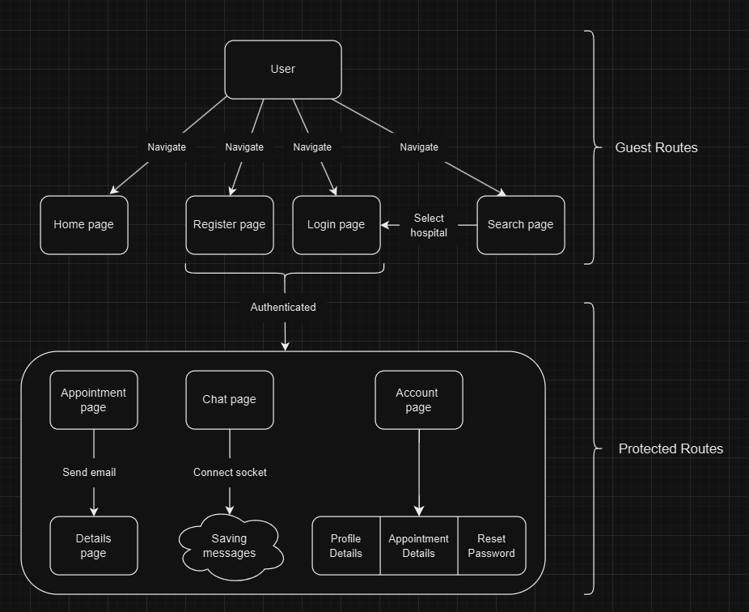

# Healthcare Assistance Website

A full-stack web application providing healthcare assistance, appointment booking, and patient-doctor interaction using **React.js**, **Node.js**, and **Spring Boot**.

[Theseus Link](https://www.theseus.fi/handle/10024/861496)

## 📸 Overview


## 🚀 Features
- User authentication (patients & doctors)
- Searching medical facilities
- Appointment booking system
- Real-time chat with doctors/agency (**encrypted content**)
- Health record management
- Admin dashboard

## 🛠️ Tech Stack
- **Frontend**: React.js, NextUI CSS
- **Backend**: Node.js (for searching, chat services), Spring Boot (for appointment and management.)
- **Database**: MongoDB
- **Authentication**: JWT-based authentication

## 🎯 Installation & Setup

### Clone project from GitHub repository
    ```sh
    git clone https://github.com/hoan301298/Healthcare-Assistance.git
    ```

### Prerequisites
Ensure you have the following installed:
- Node.js & npm
- Java & Spring Boot
- MongoDB

### Backend Setup (Spring Boot + Node.js)
```sh
# Navigate to backend directory
cd backend

# Install dependencies (Node.js part)
npm install

# Start Node.js API Gateway
npm start

# Install Spring Boot dependencies (Spring Boot part)
mvn clean install

# Start Spring Boot Services
mvn spring-boot:run
```

### Frontend Setup (React.js)
```sh
# Navigate to frontend directory
cd frontend

# Install dependencies
npm install

# Start React development server
npm start
```

After starting the project, access the application at: http://localhost:3000

### Environment Variables (.env Setup)

Create a .env file in the frontend directory and add the following:
```sh
REACT_APP_GOOGLE_MAP_API_KEY =???
REACT_APP_GEOCODE_URL =https://maps.googleapis.com/maps/api/geocode/json
REACT_APP_MAILERSEND_API_KEY=???
```
Replace your_google_maps_api_key with your actual Google Maps API key.

**If you do not have your Google Maps API key, please access & create yours at (select options Maps, Places API): https://console.cloud.google.com/apis**

Create a .env file in the backend directory and add the following:
```sh
MONGO_URL=???
GOOGLE_MAP_API_KEY=???
```

## 🤝 Contributing
Contributions are welcome! Fork the repository and create a pull request.

---
Feel free to modify and improve the project as needed. Happy coding! 🎉

